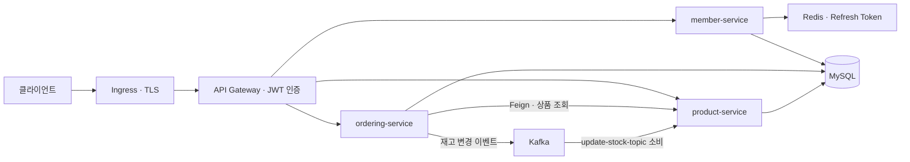

# Kubernetes & Spring Cloud MSA 실습

Spring Boot 주문 서비스를 Kubernetes에 배포하고, 모놀리식에서 MSA로 나누는 과정을 실습하는 저장소입니다. 서비스 탐색, JWT 인증, Kafka 메시지 처리부터 ECR·EKS 배포와 모니터링까지 다룹니다.

> **학습용 프로젝트입니다.** 코드에 포함된 JWT 키, 초기 관리자 계정, 로컬 DB 비밀번호는 공개된 예제 값입니다. 실제 서비스나 개인 계정에서 재사용하지 마세요. `prod`는 Kubernetes 배포 실습용 프로필을 뜻하며, 운영 준비가 완료됐다는 의미는 아닙니다.

## 프로젝트 구성

| 디렉터리 | 실습 내용 |
| --- | --- |
| [`1.k8s_basic`](1.k8s_basic) | Pod, ReplicaSet, Deployment, Service, Ingress 기초 |
| [`2.ordersystem`](2.ordersystem) | 회원·상품·주문을 하나의 애플리케이션으로 구성한 주문 서비스 |
| [`3.msa`](3.msa) | API Gateway, Eureka, member·product·ordering 서비스로 분리한 MSA |
| [`.github/workflows`](.github/workflows) | Docker 이미지 빌드, ECR push, EKS 배포 |

`2.ordersystem/k8s`에는 Argo CD, Prometheus, Grafana, Node Exporter, 오토스케일링 실습 설정도 포함되어 있습니다. 파일의 존재와 현재 클러스터에서의 실행 여부는 별개입니다.

## 기술 구성

- Java 17, Spring Boot 3.4.2, Gradle
- Spring Cloud Gateway, Eureka, OpenFeign
- Spring Data JPA, MySQL, Redis, JWT
- Kafka, ZooKeeper
- Docker, Kubernetes, AWS ECR·EKS, GitHub Actions

## MSA 요청 흐름



Gateway는 `/member-service/**`, `/ordering-service/**`, `/product-service/**` 요청을 각 서비스로 전달합니다. `StripPrefix=1`로 첫 경로를 제거하므로 `/member-service/member/doLogin`은 member 서비스의 `/member/doLogin`으로 전달됩니다.

현재 주문 생성은 Feign으로 상품과 재고를 조회한 뒤 Kafka에 재고 변경 메시지를 발행합니다. product 서비스가 메시지를 소비해 재고를 차감합니다. 데이터베이스는 실습용으로 같은 `ordermsa` DB를 사용합니다.

### Eureka와 Kubernetes 비교

| 역할 | `local` 프로필 | `prod` 프로필 |
| --- | --- | --- |
| 서비스 탐색 | Eureka에 등록된 인스턴스 조회 | Kubernetes DNS로 Service 조회 |
| Gateway 라우팅 | `lb://member-service` | `http://member-service` |
| 요청 분산 | Spring Cloud LoadBalancer | Kubernetes Service를 통한 전달 |
| Eureka 사용 | 사용 | 비활성화 |
| Redis 주소 | `localhost:6379` | `redis-service:6379` |
| Kafka 주소 | `localhost:9092` | `kafka-service:9092` |

**현재 ordering의 Feign과 직접 HTTP 호출 URL은 `http://product-service`로 고정되어 있습니다.** Gateway의 local 설정과 달리, 서비스 간 호출은 로컬 실행 시 별도 주소 설정이 필요합니다. 프로필만 바꿔 전체 주문 흐름이 실행되는 구성은 아닙니다.

## 로컬 실행

Java 17과 MySQL, Redis가 필요합니다. `local` 설정에 맞춰 MySQL의 `ordermsa` DB를 준비하고 Redis를 6379 포트에서 실행합니다.

Kafka와 ZooKeeper는 다음 Compose 파일로 실행할 수 있습니다.

```bash
docker compose -f 3.msa/ordering/docker-compose.yml up -d
```

각 모듈 디렉터리에서 별도 터미널로 실행합니다.

```bash
# 3.msa/eureka에서 실행
./gradlew bootRun

# 3.msa/member, product, ordering, apigateway에서 각각 실행
./gradlew bootRun --args='--spring.profiles.active=local'
```

Eureka는 8761 포트에서 실행됩니다. member·product·ordering은 local 설정에서 임의 포트를 사용하고 Eureka에 등록합니다. Gateway는 기본 8080 포트를 사용합니다. 서비스 모듈의 기본 프로필은 `prod`이므로 로컬 실행 시 `local`을 명시하세요.

## Kubernetes 배포 실습

매니페스트는 `jichan` 네임스페이스를 사용합니다. 배포 전 다음 항목을 자신의 환경에 맞게 준비해야 합니다.

1. 각 모듈의 `k8s/depl_svc.yml` 이미지 주소를 자신의 ECR 저장소로 변경하고 이미지를 push합니다.
2. `my-app-secrets`라는 Kubernetes Secret에 `DB_HOST`, `DB_PW`를 준비합니다. 현재 DB 설정은 사용자 `admin`, DB 이름 `ordermsa`를 사용합니다.
3. 외부 HTTPS 접속에는 Ingress Controller, cert-manager, 도메인 DNS 설정이 필요합니다. `3.msa/k8s/ingress.yml`과 `https.yml`의 도메인·인증서 설정을 함께 변경합니다.
4. Gateway의 CORS 허용 주소를 실제 실습 프론트엔드 주소로 변경합니다.

공통 의존 서비스를 먼저 배포합니다.

```bash
kubectl create namespace jichan --dry-run=client -o yaml | kubectl apply -f -
kubectl apply -f 3.msa/k8s/redis.yml
kubectl apply -f 3.msa/k8s/zookeeper.yml
kubectl apply -f 3.msa/k8s/kafka.yml

kubectl rollout status deployment/redis -n jichan
kubectl rollout status deployment/zookeeper -n jichan
kubectl rollout status deployment/kafka -n jichan
```

DB Secret과 이미지를 준비한 뒤 애플리케이션을 배포합니다.

```bash
kubectl apply -f 3.msa/member/k8s/depl_svc.yml
kubectl apply -f 3.msa/product/k8s/depl_svc.yml
kubectl apply -f 3.msa/ordering/k8s/depl_svc.yml
kubectl apply -f 3.msa/apigateway/k8s/depl_svc.yml

kubectl get pods,svc -n jichan
```

ECR은 **컨테이너 이미지 저장소**입니다. 실행 중인 서비스 간 요청은 ECR 주소가 아닌 Kubernetes Service 이름으로 전달됩니다. Kafka·ZooKeeper·Redis 매니페스트는 Docker Hub 이미지를 사용합니다.

## API 사용

아래 경로는 Gateway 주소 뒤에 붙입니다. 로컬 기본 주소는 `http://localhost:8080`이며 Kubernetes 주소는 직접 설정한 실습 도메인입니다.

| 기능 | 메서드 | 경로 | 요청 형식 |
| --- | --- | --- | --- |
| 회원가입 | POST | `/member-service/member/create` | JSON: `name`, `email`, `password` |
| 로그인 | POST | `/member-service/member/doLogin` | JSON: `email`, `password` |
| 토큰 갱신 | POST | `/member-service/member/refresh-token` | JSON: `refreshToken` |
| 상품 생성 | POST | `/product-service/product/create` | 폼: `name`, `category`, `price`, `stockQuantity` |
| 상품 상세 | GET | `/product-service/product/{id}` | 본문 없음 |
| 재고 차감 | PUT | `/product-service/product/updatestock` | JSON: `productId`, `productQuantity` |
| 주문 생성 | POST | `/ordering-service/ordering/create` | JSON: `productId`, `productCount` |
| 각 서비스 상태 | GET | `/{서비스명}/health` | 본문 없음 |

로그인 예제는 다음과 같습니다. 초기 관리자 계정은 member 서비스 시작 시 해당 이메일이 없을 때 생성됩니다.

```http
POST /member-service/member/doLogin
Content-Type: application/json
```

```json
{
  "email": "admin@naver.com",
  "password": "12341234"
}
```

로그인 응답의 `token`을 상품·주문 요청에 `Authorization: Bearer <token>`으로 보냅니다. Gateway가 `X-User-Id` 헤더를 추가합니다. 상품 생성은 JSON이 아니라 `application/x-www-form-urlencoded` 폼으로 전송합니다. `category`는 현재 DTO에만 있고 저장 코드에는 반영되지 않습니다.

Gateway 자체에는 `/health` 엔드포인트가 없습니다. 각 서비스의 health 경로도 현재 Gateway의 인증 허용 목록에 없으므로 외부 호출 시 토큰이 필요합니다. 허용 목록의 `/product/list`는 실제 컨트롤러에 구현되어 있지 않습니다.

## 실습 시 알아둘 점

- **DB 초기화:** 현재 `ddl-auto: create` 설정은 애플리케이션 시작 시 테이블을 다시 만듭니다. 보존할 데이터가 있는 DB에는 적용하지 마세요.
- **단일 인스턴스:** Redis·Kafka·ZooKeeper는 각각 `replicas: 1`이며, 영구 볼륨과 이중화 설정이 없습니다. 파드 교체 시 데이터 보존을 보장하지 않습니다.
- **의존 서비스:** 로그인은 Redis에 Refresh Token을 저장합니다. product는 Kafka 소비자를 시작하므로 Kafka Service가 없으면 애플리케이션 시작이 실패할 수 있습니다.
- **Git과 클러스터:** YAML 변경은 `kubectl apply` 또는 별도 배포 도구가 적용해야 반영됩니다. Argo CD 파일이 있어도 자동 동기화가 보장되지는 않습니다.
- **배포 자동화:** 두 GitHub Actions 워크플로는 모두 `main` push로 실행됩니다. 포크해서 사용할 때는 실행 조건, AWS Secret, ECR 주소, EKS 클러스터 이름을 먼저 확인하세요.

## 공개 저장소와 인증정보

JWT 서명 키와 기본 계정은 실습 이해를 위해 포함된 예제입니다. Base64는 암호화가 아니므로 공개된 JWT 키를 비밀값으로 취급하면 안 됩니다. 외부에서 접속 가능한 실습 서버에서는 다른 사람도 공개 계정과 키를 사용할 수 있습니다.

실제 AWS 자격 증명은 GitHub Actions Secrets를, DB 접속 값은 Kubernetes Secret을 사용합니다. 개인 AWS 키, 개인키, 실제 DB 비밀번호는 예제 설정에 넣거나 커밋하지 마세요. 실제 비밀값을 실수로 공개했다면 파일 삭제에 앞서 해당 값을 폐기·교체해야 합니다.

실습이 끝나면 외부 Ingress를 닫거나 실습 리소스를 정리하세요. EKS·로드 밸런서·RDS 등 AWS 리소스는 애플리케이션 파드를 중지해도 비용이 발생할 수 있으므로 별도로 확인해야 합니다.
